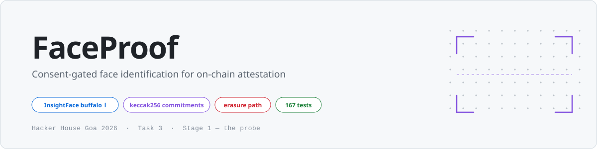
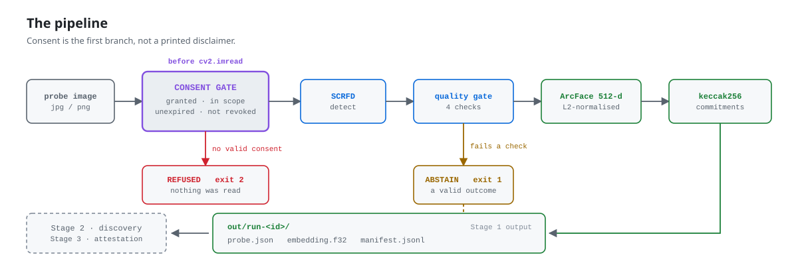
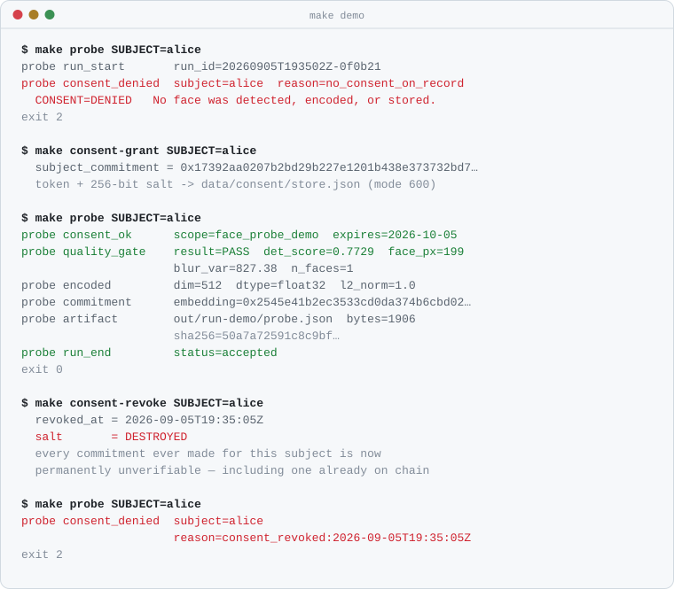

<div align="center">

<picture>
  <source media="(prefers-color-scheme: dark)" srcset="assets/hero-dark.svg">
  <source media="(prefers-color-scheme: light)" srcset="assets/hero-light.svg">
  
</picture>

<br/>

[](https://github.com/Anbi105/HHGoa2026-Task3-FaceID-Blockchain/actions/workflows/tests.yml)
[](#tests)
[](#tests)
[](pyproject.toml)
[](#where-this-sits)

**A face never becomes a vector without consent.**<br/>
Withdraw that consent and every past commitment becomes unverifiable — including one already written to an immutable chain.

</div>

---

## The pipeline

<picture>
  <source media="(prefers-color-scheme: dark)" srcset="assets/pipeline-dark.svg">
  <source media="(prefers-color-scheme: light)" srcset="assets/pipeline-light.svg">
  
</picture>

> [!IMPORTANT]
> **The consent gate runs before `cv2.imread`.** For a subject with no valid consent, no image is read, no face is detected, and no vector is computed. `test_refusal_happens_before_detection` asserts the detector is never called on that path — the refusal is provably inert, not a printed disclaimer.

---

## See it run

Every command is a Makefile target, so nothing is typed live during the take. This is real output, not a mock-up.

<div align="center">
<picture>
  <source media="(prefers-color-scheme: dark)" srcset="assets/demo-dark.svg">
  <source media="(prefers-color-scheme: light)" srcset="assets/demo-light.svg">
  
</picture>
</div>

The arc is the argument. The **same image** is refused, then accepted, then refused again — and the third refusal is permanent, because revocation destroyed the salt.

```bash
make demo    # runs exactly the sequence above
```

---

## Quick start

```bash
git clone -b person-1/stage-1-probe https://github.com/Anbi105/HHGoa2026-Task3-FaceID-Blockchain.git
cd HHGoa2026-Task3-FaceID-Blockchain
python3 -m venv .venv && source .venv/bin/activate
pip install -e ".[dev]"
```

```bash
make setup    # pre-download model weights (~330 MB) — do this BEFORE recording
make test     # 167 tests, ~0.4s, no model and no network required
```

> [!TIP]
> `make setup` exists because of the unedited-recording constraint: nothing on the critical path may be slow, so the weights are staged before the camera rolls.

<details>
<summary><b>Every command</b></summary>

| Command | Purpose |
|---------|---------|
| `make setup` | Pre-download model weights |
| `make config` | Print the effective configuration |
| `make consent-grant SUBJECT=alice` | Record consent |
| `make consent-list` | Show every record and its live status |
| `make consent-revoke SUBJECT=alice` | Withdraw consent, destroy the salt |
| `make probe SUBJECT=alice IMAGE=…` | Run a consent-gated probe |
| `make calibrate` | Measure the acceptance threshold |
| `make demo` | The full recorded sequence |
| `make test` / `make cov` | Tests, with coverage |
| `make fixtures` | Regenerate + verify synthetic demo images |
| `make demo-variants SRC=photo.jpg` | Derive gate demos from a real photo |
| `make clean-runs` | Delete `out/` |

Exit codes: `0` accepted · `1` abstain · `2` refused, no consent · `3` usage error.

</details>

---

## The quality gate

Checks run in order. The first failure reports **the value and the threshold it missed**, so the reason explains itself on camera.

| # | Check | Gate | Rejection reason |
|:-:|-------|:----:|------------------|
| 0 | Readable | — | `unreadable_image` |
| 1 | Face present | — | `no_face_detected` |
| 2 | Detection confidence | `≥ 0.62` | `low_detection_confidence:0.31<0.62` |
| 3 | Face size, shorter side | `≥ 90 px` | `face_too_small:50px<90px` |
| 4 | Blur, Laplacian variance | `≥ 45.0` | `image_too_blurry:3.9<45.0` |
| 5 | Single subject | `secondary/primary ≤ 0.60` | `ambiguous_subject:2_faces_ratio_0.99>0.6` |

> [!NOTE]
> Check 5 is the one people skip. Group photos are the most common realistic input, and silently picking the largest face is how you produce a confidently wrong match on video. A blurry, angled or 40-pixel face yields an embedding that is *confidently wrong* — reject early and say why.

---

## Consent, commitments, erasure

A grant mints a random consent token and a **256-bit per-subject salt**, stored at `data/consent/store.json` (mode `600`, gitignored). Neither ever leaves the host.

Exactly two values cross into the attestation path, both opaque 32-byte digests:

| Leaf | Value | Why it carries nothing |
|------|-------|------------------------|
| **subject** | `keccak256(consent_token)` | The token is a random UUID4. It commits to a *consent event*, not a person — two grants to the same subject produce unrelated digests. |
| **probe** | `keccak256(salt ‖ embedding)` | Commits to the face without carrying it. Little-endian float32, pinned by golden tests so the encoding cannot drift. |

> [!WARNING]
> **Revocation destroys the salt and keeps the record.** Afterwards, reproducing an anchored `keccak256(salt ‖ embedding)` means guessing 256 bits — including for a root already on chain. The record survives so the withdrawal stays auditable.
>
> `test_commitment_unverifiable_after_erasure` asserts it. The guarantee is **"unverifiable"**, not "deleted" — see [LIMITATIONS.md](LIMITATIONS.md).

---

## Stage 2 contract

Stage 2 reads the run directory. It does not import Stage 1's objects — that boundary is what lets each stage run alone, resume after a mid-recording failure, and prove Stage 3 could not have influenced Stage 2.

```python
from faceproof.handoff import load_record, read_embedding

run = "out/run-demo"
record = load_record(run)
vector = read_embedding(run)          # (512,) float32, L2-normalised

if record["status"] == "accepted":
    hits = index.search(vector)       # your FAISS query
else:
    record["rejection_reason"]        # "image_too_blurry:3.9<45.0"
```

<details>
<summary><b>What <code>out/run-&lt;id&gt;/</code> contains</b></summary>

| File | Contents | Safe to show? |
|------|----------|:-------------:|
| `probe.json` | Status, quality measurements, the gate applied, full config, image digest, both commitments | ✅ no biometrics, no PII |
| `embedding.f32` | The raw 512-d vector, little-endian float32, 2048 bytes | ❌ **local only**, gitignored |
| `manifest.jsonl` | Append-only run log with artifact digests | ✅ |

</details>

<details>
<summary><b>Why every number in <code>probe.json</code> is a string</b></summary>

```json
"quality": {
  "det_score": "0.772918",
  "blur_var":  "827.384790",
  "face_px":   199
}
```

A bare float that reaches a serialised record is the classic cause of a proof that verifies locally and fails against the chain — `repr` differs across machines and the bytes stop matching. Every number goes through `q()`, and `_reject_floats` raises loudly if one survives. **Do not weaken it.**

Stage 3's `canonical.py` will define the same `q()`. The two must stay byte-identical or leaf 0 will not reproduce — import this one rather than writing a second.

</details>

The in-process API is still available:

```python
from faceproof import encode, cosine

probe, reason = encode("photo.jpg")
if probe is None:
    print(reason)              # a str subclass — ==, startswith, f-strings all work…
    print(reason.metrics)      # …carrying what was measured, so no second detection pass
else:
    probe.embedding            # (512,) float32
```

---

## Calibration

> [!CAUTION]
> **Not yet measured.** `accept_at = 0.55` is the guide's placeholder, not a result. `make config` prints a warning while `data/calibration.json` is absent, so the recording cannot accidentally imply otherwise.

```
data/calib/<subject_id>/*.jpg      # 2+ subjects, 5–10 images each, varied lighting and angle
```

```bash
make calibrate      # writes data/calibration.json — commit it
```

The output records **both full score distributions** and a sha256 fingerprint of the exact image set, so the number is auditable rather than asserted. It turns *"we used 0.5"* into *"we measured a true-accept rate of 0.94 at zero false accepts on our own held-out pairs, so we set the gate at 0.57."*

<details>
<summary><b>Why synthetic faces cannot substitute — measured, not assumed</b></summary>

ArcFace maps drawings into a narrow region of the embedding space. Across four visually distinct synthetic subjects:

| | genuine | impostor | separation |
|---|:---:|:---:|:---:|
| synthetic faces | 0.85 | **0.71** | 0.05 |
| real faces (typical) | 0.85 | ~0.30 | >0.30 |

An impostor mean of 0.71 sits far above any usable threshold, so a number measured on them would look like evidence and be worthless. The fixtures are also detector-fragile: blurring drops `det_score` to 0.54 (rejecting for *low confidence*, not blur), and downscaling or side-by-side composition makes them undetectable entirely.

So the synthetic set supports exactly two branches — `PASS` and `no_face_detected`. For the rest, derive from a real consenting photo:

```bash
make demo-variants SRC=path/to/photo.jpg
```

That script searches for the mildest transform landing in each intended branch and **verifies every image it writes** against the real detector, rather than assuming a fixed blur radius works.

</details>

---

## Tests

```bash
make test    # 167 tests, ~0.4s
make cov     # 97% statement coverage
```

| Property | |
|----------|--|
| Model weights required | ❌ none — `insightface` is imported lazily inside `app()` |
| Network required | ❌ none |
| Writes outside `tmp_path` | ❌ none — an autouse fixture repoints `data_dir` and `out_dir` |
| Passes under `python -O` | ✅ no behaviour hidden behind `assert` |
| CI matrix | Python 3.11 · 3.12 · 3.13 |

**Mutation-checked.** Each of these breaks at least one test:

| Mutation | Caught by |
|----------|-----------|
| `SAFETY_MARGIN` 0.03 → 0.99 | `test_threshold_follows_the_rule` |
| `overlap_warning` hardwired `False` | `test_separation_and_overlap_flag_agree` |
| Blur gate disabled | `test_image_too_blurry` |
| Ambiguity gate disabled | `test_ambiguous_subject` |
| Largest-face sort removed | `test_largest_face_is_selected` |
| Embedding byte encoding changed | `test_embedding_bytes_are_pinned` |

> [!NOTE]
> The golden-vector tests pin the embedding encoding and the resulting commitment to fixed hex, and assert Ethereum `keccak256` rather than NIST SHA3. If one fails, **do not update the expected value** — a changed encoding invalidates every commitment already anchored.

---

## Where this sits

| Stage | Scope | Modules | Status |
|:-----:|-------|---------|--------|
| **1** | **Probe** — detect, gate, encode, consent-bind | `config` `manifest` `face` `consent` `handoff` `calibrate` `cli` | ✅ **complete** · calibration data pending |
| 2 | Discovery — social index + reverse image search | `ingest_bsky` `index` `channel_a` `channel_b` `fuse` | ⬜ not started |
| 3 | Attestation — canonicalise, commit, anchor, verify | `canonical` `merkle` `bundle` `chain` `anchor` `verify` + `contracts/` | ⬜ not started |

```
.
├── faceproof/
│   ├── config.py      all tunables; prints itself into every run      §4
│   ├── manifest.py    append-only JSONL run log                       §4
│   ├── face.py        detection, quality gate, ArcFace encoding       §5
│   ├── consent.py     consent store, commitments, erasure             §8 · D12
│   ├── handoff.py     the Stage 1 → Stage 2 boundary artifact         §2
│   ├── calibrate.py   threshold measurement                           §5 · D3
│   └── cli.py         the recorded surface
├── tests/             167 tests, fully mocked
├── scripts/           fixture + artwork generators, self-verifying
└── assets/            README artwork, light and dark
```

---

## Design rationale

Nineteen decisions with their trade-offs live in **[DECISIONS.md](DECISIONS.md)** — six from the guide, thirteen specific to this implementation:

- **Why the consent check precedes `imread`** — checking after encoding means a biometric already exists for someone who did not agree
- **Why the subject leaf hashes the token, not the subject id** — a 32-byte digest of a short string is trivially brute-forced
- **Why `Rejection` subclasses `str`** — carries its metrics without breaking a single existing caller
- **Why revocation destroys the salt but keeps the record** — erasure without destroying the audit trail

Ten honest constraints live in **[LIMITATIONS.md](LIMITATIONS.md)**, including no liveness detection, unmeasured demographic performance, and the fact that erasure covers this host and not copies.

<sub>Artwork is generated, not hand-drawn: `python scripts/gen_readme_assets.py` rebuilds every SVG in both themes.</sub>

---

<div align="center">
<sub>

Built for the unedited take. Every command is a Makefile target so nothing is typed live,<br/>
and every stage prints its evidence so the viewer never has to take your word for anything.

</sub>
</div>
